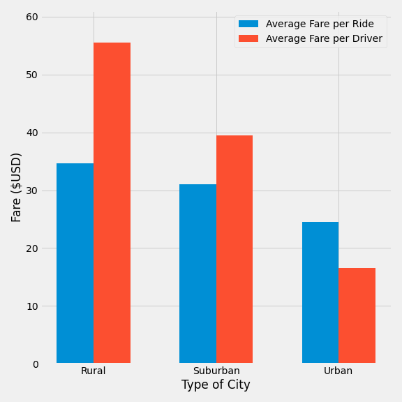

# PyBer Analysis

## Overview

V. Isualize has requested a summary of information for PyBer. This is to be acomplished using Pandas and Matplotlib libraries in Python. The requested format of the results is a minimum of one DataFrame and at minimum one multiple-line graph. In the dataframe, of particular interest is the Total Rides, total Drivers, Total Fares, Average Fare per Ride, and Average Fare per Driver separated by the type of trip (Rural, Suburban, Urban). With regards to the multiple-line graph, of interest is the total fares history per type of ride. 

## Results

The following dataframe and graphs are produced by the code found [here](PyBer.ipynb) where the raw data can be found for cities and ride [here](Resources/city_data.csv) and [here](Resources/ride_data.csv) respectively.

There is a lot of available information from the summary dataframe shown above.
It can be shown in a pie chart form that a majority of rides are urban in nature. It can also be seen that a majority of drivers are also urban (also in pie chart form).

Similarly, the total fares also has a heavier distribution towards urban cities. However, the average Fare per Ride favours Rural cities. This statistic aligns well with the description of a rural nature in that destinations are frequently further apart. The increased average fare per ride coincides with this as one could expect a ride to a farther location will imply more time to arrive. However, when comparing average fare per ride to average fare per driver, it is implied that the method of fare/pay distribution is imbalanced and favours the drivers in rural cities as depicted below.

The total rides being lower in the rural and suburban areas suggests that the population in those cities will more than likely have a personal means of transportation and will not use PyBer as frequently as it is statistically more expensive, perhaps not as available or perhaps not as necessary. 

As suggested by the ride & driver distribution, the total fares of each individual city type follow suit

Notably, PyBer use increases in Urban and suburban cities from January to close to the end of February. One potential explanation for this could be post-holiday return to work patterns. Another potential explanation is dependent on the climate of the cities. Are the cities perhaps in high latitude locations? (ie: the Northern Hemisphere) where temperatures in winter drop and encourage ride usages.

## Summary

Using this data, we can approach a growth of PyBer in a couple different methods. While each will affect supply and demand, how to go about affecting supply and demand of PyBer can be fairly diverse.

The first method involves accessibility via supply of drivers. Under the assumption that PyBer is not used because it is not available, one method to grow PyBer would be to increase accessibility in Rural and Suburban cities by increasing the number of drivers in rural and suburban cities. This would reduce the average fare per driver while keeping the average fare per ride the same but can ultimately raise the Total Fares if there is a greater supply assuming a demand exists. 

A second method to improve on PyBer's growth is to directly consider fares. We can consider investing in the existing Urban market as Urban rides has the highest distributions in ride types. One such method of investment could be increasing fares for urban zones which would push the total fares up but also assumes that customers will continue to use PyBer at it's current rate. Similarly, along the same vein of increasing fares, one course of action that can be recommended is to keep the Urban fares the same and increase fares in rural cities and suburban cities to close the desparity between these cities and urban cities which still assumes the use of PyBer remains the same.

A third method is to piggyback on the concept of accessibility by using fare adjustment to adjust for the ride type distribution. For Urban areas for instance, a decrease in fare could result in higher demand; a demand that could outweight the difference in fares. Similarly, one could postulate that a reduced fare will encourage suburban and rural cities to use PyBer more as well resulting in an  overall increase in rides which can potentially lead to a greater overall use and profit. 

Finally, with more historical data, it could also be possible to predict the supply and demand. With this, there is a possibility to increase or decrease the reserve drivers count accordingly or offer fare reduction knowing when demand will be high to encourage greater than average use. 
